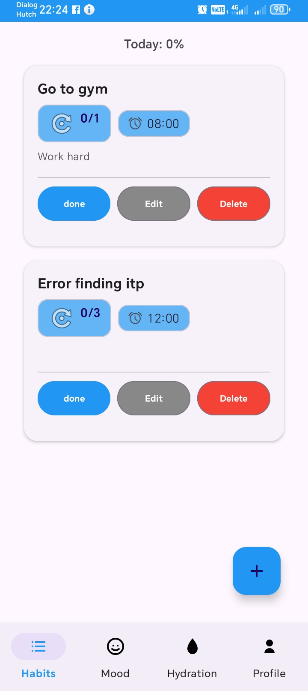
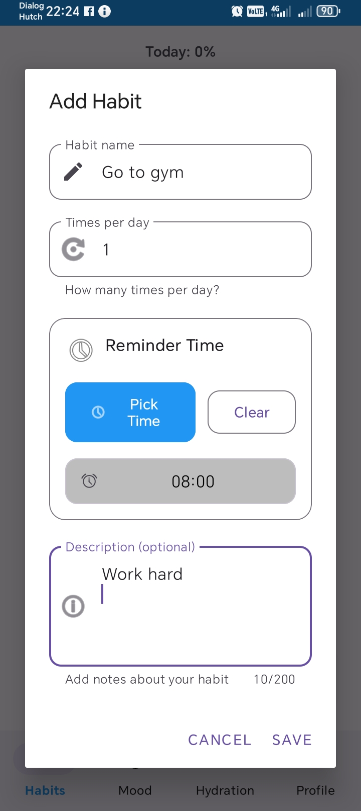
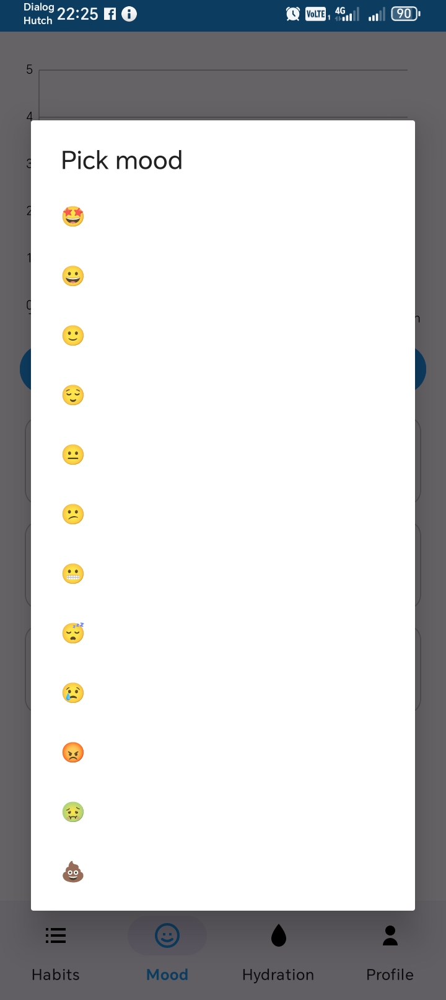
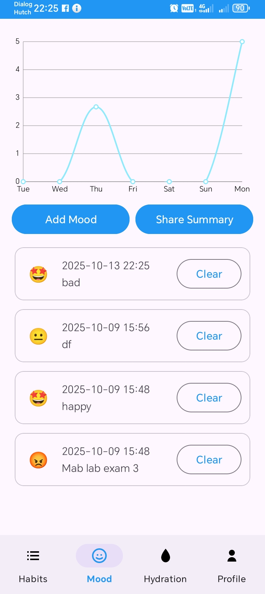
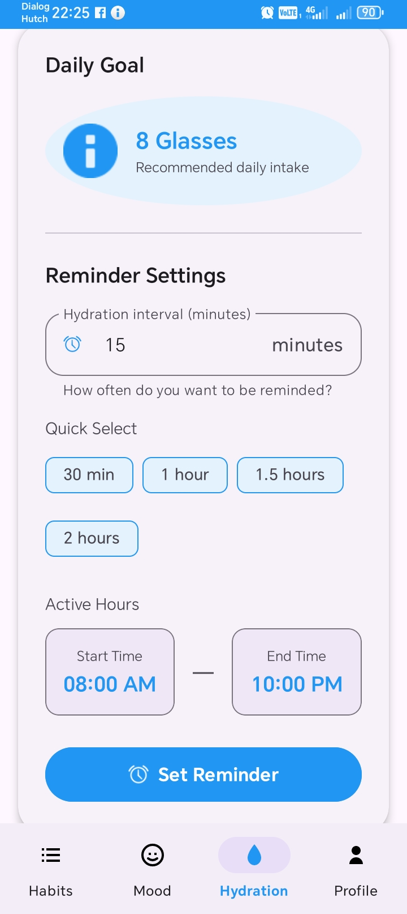
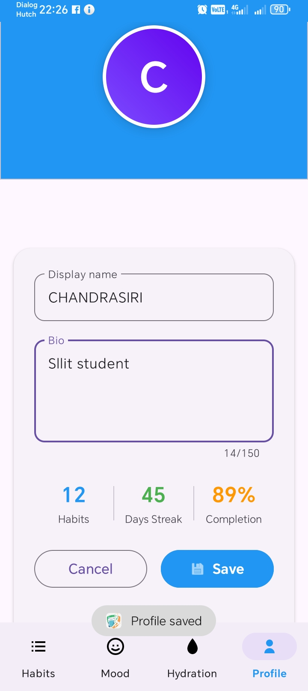

# 🌿 HealthyVibe – Wellness & Habit Tracking App  

**Category:** Health & Lifestyle  

---

## 📖 Overview  
HealthyVibe is a **wellness-focused habit tracking application** designed to help users build healthy routines and maintain a balanced lifestyle.  
The app allows users to create habits, track daily progress, set reminders and visualize streaks — making habit building simple, fun, and motivating.

Whether you're improving sleep, drinking more water, exercising, or focusing on productivity, **HealthyVibe keeps you accountable every day**.

---

## 🚀 Key Features  
- ✔️ **Create Habits** – Add custom habits with goals  
- 📅 **Daily Habit Tracking** – Mark habits as complete each day  
- 🔔 **Smart Reminders** – Push notifications to stay consistent  
- 🔥 **Streak System** – View continuous progress and motivation boosts  
- 📊 **Progress Analytics** – Weekly & monthly progress overview  
- 🎨 **Clean UI** – Minimal, modern, and easy to use  
- ⭐ **Category-Based Habits** – Health, Fitness, Productivity, Mindfulness  

---

## 🛠️ Tech Stack  
- **Language:** Kotlin / Java  
- **IDE:** Android Studio   
- **Storage:** SharedPreferences 
- **Version Control:** Git & GitHub  

---

## 📸 Screenshots  

### 🏠 Home Dashboard  


### ➕ Add Habit  


### ➕ Add Mood  


### 📅 Mood Tracking graph 
s

### 📅 hidration reminder 


### 👤 Profile  


---

## 🔧 Installation & Setup  
1. Clone the repository:  
   ```bash
   git clone https://github.com/Udeep10-dev/HealthyVibe.git

